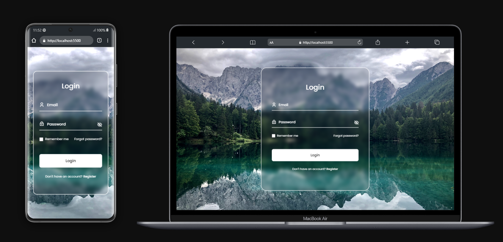

# Responsive Login Page

## Description

Welcome to the Responsive Login Page, a project designed for a seamless login experience across various devices. This login page is crafted with a combination of HTML, CSS, and JavaScript to ensure responsiveness and an interactive user interface.

- Animated Login Form Using HTML CSS & JavaScript
- It contains a stylish and beautiful background.
- With animation of floating labels.
- And a button to show and hide the password.
- Developed first with the Mobile First methodology, then for desktop.
- Compatible with all mobile devices.

## Technologies Used

- **HTML:** Provides the structure and layout of the login page.
- **CSS:** Styles the page, making it visually appealing and consistent.
- **JavaScript:** Adds interactivity and dynamic behavior to the login process.

## Features

- Responsive design for a user-friendly experience on different devices.
- Modern and visually appealing user interface.

## Live Demo

Explore the live demo: [Live Demo](https://guidopellegrini.github.io/responsive-login-form/)

## Preview

